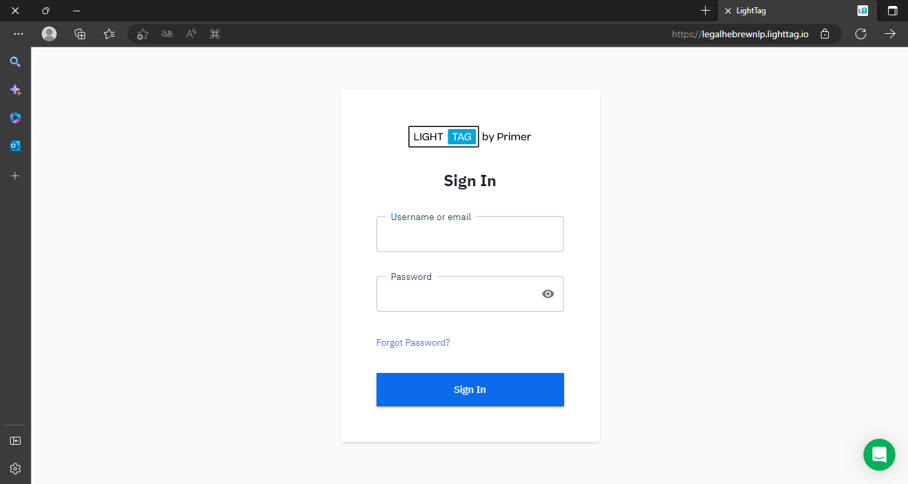
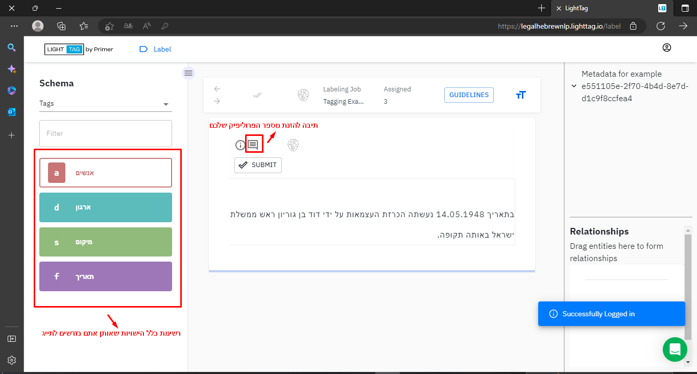
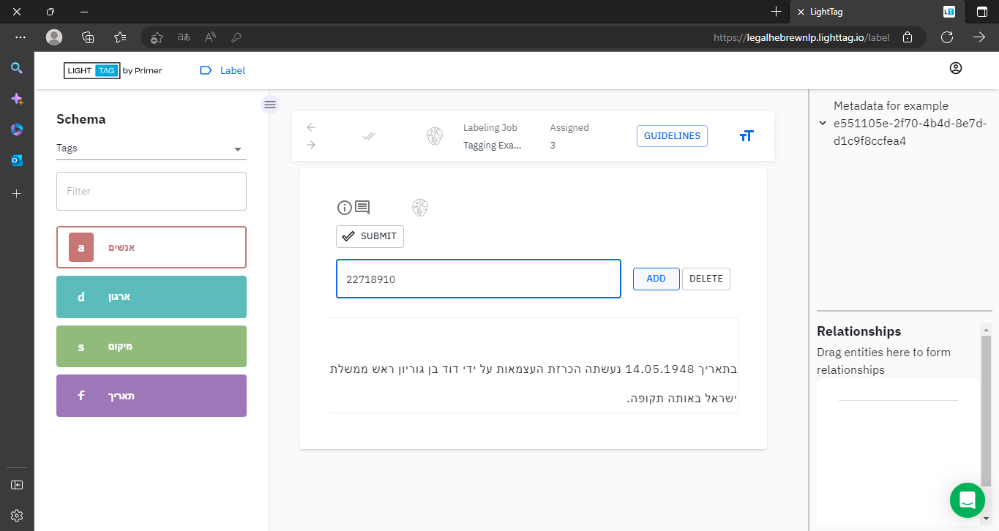
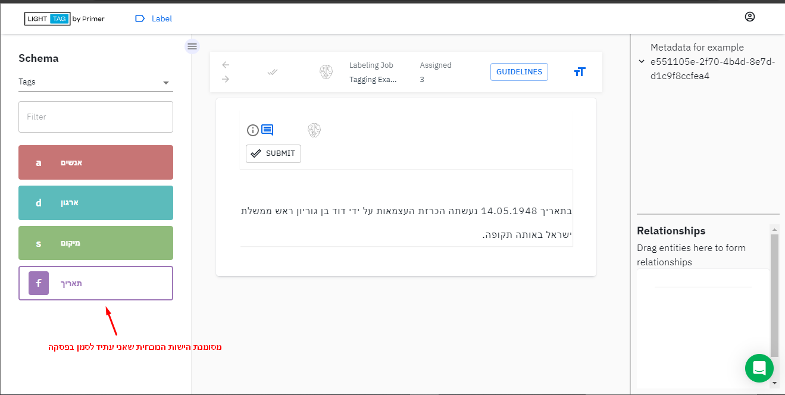
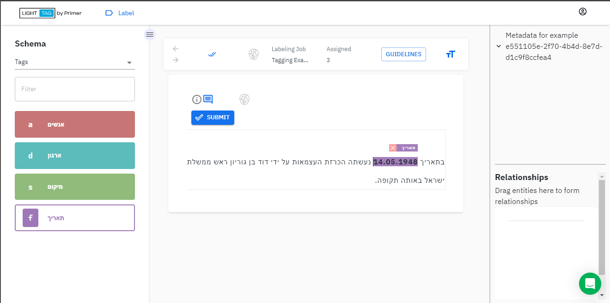
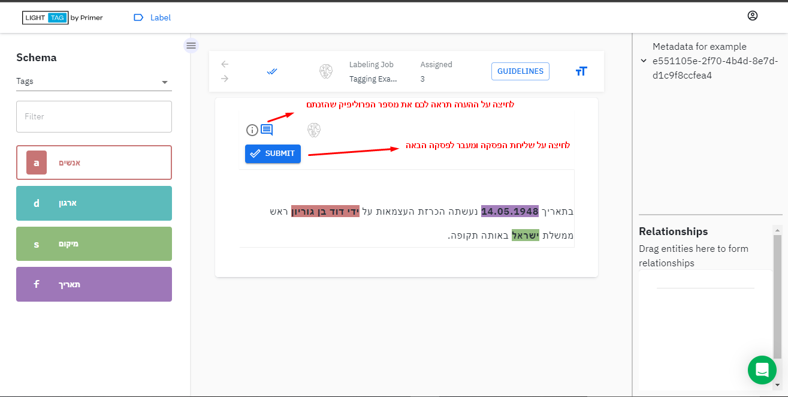
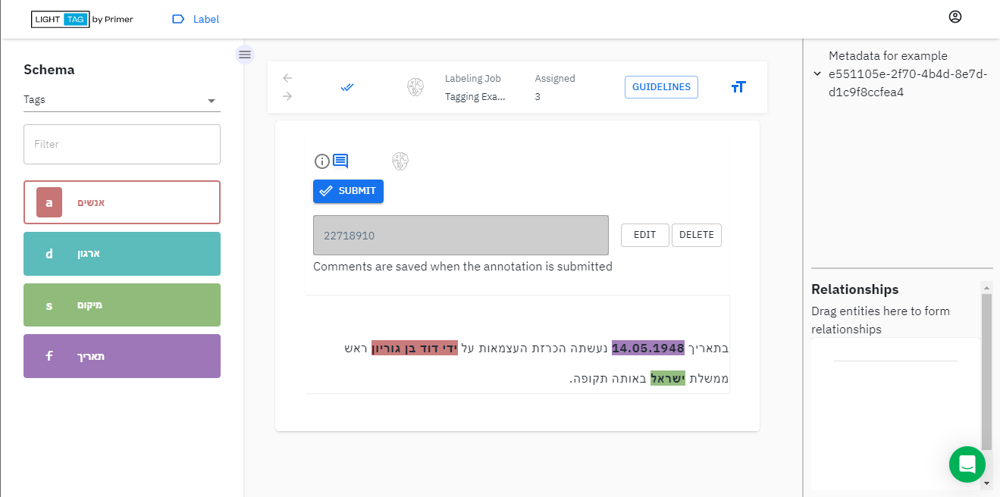
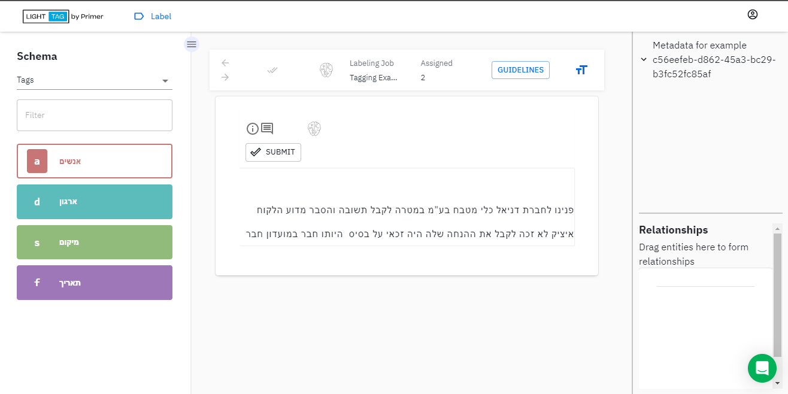

# פרויקט תיוג ישויות
## הנחיות והסברים

### פתח דבר
המשימה שלפניכם היא תיוג ישויות בכלי תיוג(פלטפורמת התיוג) מיועד בשם [LightTag](https://legalhebrewnlp.lighttag.io/).  
הישויות ישמשו אותנו בבניית מודלי שפה בתחום המשפטי בעברית. אותו מודל "יאפשר" להבין טקסטים משפטיים בעברית ויסייע בשיפור הכלים הטכנולוגיים בתחום המשפט.  
תיוג ישות נועד לסמן את השתייכותה לקטגוריה מסוימת. המקרה הקלאסי של ישויות שאנו מכירים לדוגמה ישות אדם וישות מקום במשפט הבא: `דני` הלך לאכול ארוחת צהריים ב`ירושלים`.   
בפרויקט תיוג זה הישויות הן ישויות הקשורות לתחום המשפטי.  

אתם רשאים לתייג כמה פסקאות שתרצו, התשלום מתבצע בהתאם לכל פסקה מתויגת שאתם שולחים.
הסבר כיצד לתייג(עם תמונות), שאלות נפוצות וסרטון הדרכה מצורפים בהמשך.  

### טבלת הישויות *המשפטיות*:

כאמור, אתם נדרשים לתייג ישויות - אתם מקבלים פסקה חדשה, מזהים את כלל הישויות המשפטיות הרלוונטיות שמופיעות באותה פסקה, מסמנים את הישות בתג הרלוונטי לה וממשיכים לישות הבאה שזיהיתם.

| שם ישות | הסבר | דוגמאות |
| --: | --: | --: | 
| שופט | שופטים מוזכרים בפסקה בנוגע לפסק הדין המדובר או פסק דין מאוזכר | בקשת רשות ערעור על פסק דינו של בית המשפט המחוזי בבאר שבע (השופטים   `ש' דברת`, `א' ואגו` ו-`ג' גדעון`) מיום 2.11.2016 בעמ"ש 6926-07-16, במסגרתו נדחה ערעורו של המבקש על פסק דינו של בית המשפט לענייני משפחה בבאר שבע (השופט `א' גביזון`) מיום 24.5.2016 בתמ"ש 61046-01-16.   ערעור על גזר דינו של בית המשפט המחוזי בנצרת בתיק תפ"ח 537/05 שניתן ביום 25.4.07 על-ידי השופטים בן `דוד מנחם`, `ארבל בנימין` ו`אברהם אברהם`.   אני מצטרפת למסקנתה של חברתי השופטת `א' פרוקצ'יה` כי במקרה דנן חלה השעייה.
| בית משפט | אזכור לבית משפט בפסקה יכול להיות בית המשפט שדן בתיק שמוזכר בפסקה או בית משפט מאוזכר | בקשת רשות ערעור על פסק דינו של `בית המשפט המחוזי בבאר שבע` (השופטים ש' דברת, א' ואגו ו-ג' גדעון) מיום 2.11.2016 בעמ"ש 6926-07-16, במסגרתו נדחה ערעורו של המבקש על פסק דינו של `בית המשפט לענייני משפחה בבאר שבע` (השופט א' גביזון) מיום 24.5.2016 בתמ"ש 61046-01-16.   ערעור על גזר דינו של `בית המשפט המחוזי בנצרת` בתיק תפ"ח 537/05 שניתן ביום 25.4.07 על-ידי השופטים בן דוד מנחם, ארבל בנימין ואברהם אברהם.    בפנינו שני ערעורים על שני פסקי דין שניתנו `בבית המשפט לעניינים מינהליים בחיפה`. 
| עורך דין | שמות עורכי דין משני הצדדים | מתגובתו של `עורך הדין רייטן` מיום 25.4.2022 עולה כי הוא מייצג את הגב' נגרי (אחת מחליפי המשיב 1 ז"ל) בגדרי ההליך שבכותרת, ואכן ביום 24.4.2022 הוגשו סיכומים מטעמה של הגב' נגרי.  נוכח ההודעות מטעם `עורכי הדין רייטן` ו`חסטר` כי הם אינם מייצגים את יתר חליפי המשיב 1, ובשים לב להוראות תקנות המצאת מסמכים לפי אמנת האג 1965, התשל"ו-1975, אין בידי לקבל את הבקשה להורות על המצאה של הערעור לחליפי המשיב 1 באמצעות עורכי דין אלה.  עתירה למתן צו על תנאי. בשם העותר: `עו״ד מנשה סלטון`.  |
| עותר | הצד שפונה לבית המשפט בתיק שמוזכר בפסקה | נוכח כך, הגיש `האב` ביום 31.1.2016 תביעה בבית המשפט לענייני משפחה כנגד חברת הביטוח ואמו של הקטין למתן סעד הצהרתי וסעד כספי בסך 18,269 ש"ח. `האב` טען כי הוא מצוי על סף קריסה כלכלית בשל תשלומי המזונות הגבוהים שהוא נדרש להעביר לאם באופן שוטף.  במסגרתו נדחה ערעורו של `המבקש` על פסק דינו של בית המשפט לענייני משפחה בבאר שבע (השופט א' גביזון) מיום 24.5.2016 בתמ"ש 61046-01-16.  `המערערת` 2 בע"א 10436/08 היא `המערערת 1` בע"א 7615/09 (להלן –  `המערערת`). שני `המערערים` האחרים הינם בניה של `המערערת`. `המערערת` הינה בעלת הזכויות במגרשים 4 ו-5 בחלקה 38, גוש 10284 (חלקה 38 תיקרא להלן – החלקה.|
| משיב | שמות ואזכורי המשיבים/מגיבים בתיק | נוכח כך, הגיש האב ביום 31.1.2016 תביעה בבית המשפט לענייני משפחה כנגד `חברת הביטוח` ו`אמו של הקטין` למתן סעד הצהרתי וסעד כספי בסך 18,269 ש"ח. האב טען כי הוא מצוי על סף קריסה כלכלית בשל תשלומי המזונות הגבוהים שהוא נדרש להעביר `לאם` באופן שוטף, וכי סכום הפיצוי `מחברת הביטוח` אמור היה לאפשר לו לעמוד בתשלומים. לטענתו, `האם` כלל איננה צד לחוזה הביטוח, ולפיכך לא הייתה צריכה לקבל "זכות וטו" על אופן השימוש בכספי הפיצוי.  העובדות שהובאו על ידי `המשיבות` בענייננו מצביעות על כך שעד שנת 1994 נמנעה מהן האפשרות לקיים הליך משפטי בישראל כנגד המבקש.  מדברי `באי-כוח המשיבים`, עלה כי עקב אילוצים שונים הקמת הגדר באזור גוש-עציון אינה כלולה בתכניות העבודה של השנה התקציבית הבאה ולעת הזו טרם נקבע מועד ליישום התכנית. |
| אדם אחר | שמות ואזכורים של אנשים אחרים כמו עדים וכד' | במסגרת הסכם הגישור הסכימו בעלי המניות על מינויו של `רו"ח אורי כהן` כמומחה חשבונאי מוסכם ומכריע לשם קביעת שווי החברות המשותפות (להלן: `המומחה המכריע`). נקבע כי בהתאם לשווי החברות כפי שיקבע `המומחה המכריע` בחוות דעתו, יחושב שווי התמורה המגיעה למבקש על פי מפתח שנקבע בהסכם הגישור.  לכתב התביעה צורפה חוות דעתו של `פרופ' י' טלר`, ועל פיה הפרקטיקה המקובלת בשנים 2000-2001, בהן התרחש המקרה (להלן: המועד הרלוונטי), כללה, בין היתר, מעקב אחר צוואר הרחם בהריון תאומים אסימפטומטי. לעומת זאת, בחוות הדעת של `פרופ' א' הרמן` ובתצהירי הרופאים המטפלים מטעם המשיבה נטען, בין היתר, כי פרקטיקה זו לא הייתה נוהגת במועד הרלוונטי. | 
| חברה | חברה מסחרית | ההליך דנן עניינו בבקשה לאישור תובענה כייצוגית שהגישה המשיבה, `חברת אופק פריידס בע"מ` (להלן: הבקשה לאישור ו-המשיבה, בהתאמה), נגד המבקשת, `חברת דואר ישראל בע"מ` (להלן: `דואר ישראל`), בגין הפרות נטענות של התחייבויות האחרונה ובגין גביית תשלומים ביתר באופן המנוגד לדין, לשיטת המשיבה. | 
| ארגון לתועלת הציבור | שמות ואזכורים של ארגונים ללא מטרות רווח | העתירות הוגשו על-ידי עותרים ציבוריים, ובשתיהן נטען כי התנהלותה הכספית של המדינה מול הרשות הפלסטינית אינה עומדת בדרישות הדין, בדגשים שונים. עתירה אחת (בג"ץ 3131/22) הוגשה על-ידי `פורום קהלת`, ועתירה נוספת (בג"ץ 3745/22) הוגשה על-ידי `המרכז לחקר התקשורת` (`מכון "מבט לתקשורת פלסטינית"`). בהתאם, ומבלי לפרט, הסעדים המרכזיים בעתירות כוונו לכך שנורה למשיבים, שרי הביטחון והאוצר ומנהל רשות המסים, להימנע מהעברת כספים נוספים שלא בהתאם להסדרים הנזכרים, וכן לפעול לגביית הכספים שכבר הועברו שלא בדרך האמורה. בצידה של העתירה שהגיש `פורום קהלת` הוגשה גם בקשה למתן צו ביניים, שלא התקבלה (בהחלטה מיום 14.7.2022).   העותרות, `"תנו לחיות לחיות"` ו`"אנימלס"`, הן עמותות הפועלות למען בעלי חיים. |
| רשות שלטונית | מוסד ציבורי, מחלקה, שירות ציבורי וכד' | במוקד ההליכים שלפנינו ניצבת השאלה אם `עיריית הוד השרון`, היא המשיבה 1 ב-עע"מ 9254/20 והמבקשת ב-בר"מ 9269/20 (להלן גם: `העירייה`).   המערערים מלאים טענות כרימון הן כלפי `מוסדות התכנון` והן כלפי בית משפט קמא. |

  

### כיצד מתייגים?
הופנתם לאתר התיוג עם שם משתמש וסיסמא שקיבלתם לאחר הסכמה להשתתף בפרויקט תיוג זה באתר [LightTag](https://legalhebrewnlp.lighttag.io/).  
עם כניסתם לאתר זה הדף הראשון שרואים:

    
 

הזינו את שם המשתמש והסיסמא שקיבלתם ואתם מיד תועברו לפסקה הראשונה שאותה תוכלו להתחיל לתייג.  

המסך המרכזי שאיתו תעבדו:  

יש לשים לב למספר שדות מרכזיים המסומנים במסך. ראשית כמובן, השדה עליו אתם לוחצים על מנת להזין מספר פרוליפיק שלכם. לאחר לחיצה על השדה, הזינו את מספר הפרוליפיק שלכם ולחצו על כפתור Add:

 

לאחר לחיצה על כפתור Add המסך שתראו יאפשר לכם לערוך בכל רגע נתון, כמובן לפני לחיצה על Submit וודאו את מספר הפרוליפיק שהזנתם בכדי שאם טעיתם באחת הספרות בהזנה - תוכלו לתקן. 

מצד שמאל על המסך יופיעו לכם תמיד כלל הישויות שאותן אתם נדרשים לזהות ואז לתייג. *חשוב להדגיש - לא בכל פסקה שתתייגו יופיעו כל הישויות אך יש למצות את החיפוש והזיהוי לפני שליחה ומעבר לפסקה הבאה*.  

#### אופן התיוג:

קוראים את הפסקה, אם זיהינו ישות מסוימת מרשימת הישויות - הולכים לרשימת הישויות ולוחצים עליה, היא תסומן. לדוגמה במקרה הבא זיהיתי את `14.05.1948` כתאריך שהוא ישות ולכן אלך לישות `תאריך` בצד שמאל ואלחץ עליה. לאחר הלחיצה נראה כך:

 
 
 
כעת נסמן את הישות בפסקה - כיצד נעשה זאת? נסמן מתחילת הישות עד סופה עם העכבר. זה כבר יסמן את הישות בצבע ובתג תאריך הרלוונטי כי בחרנו בו קודם לכן, זה נראה כך: 

 
 
 
כעת נמשיך ונזהה את שאר הישויות, חשוב לשים לב להחליף את הישות הרצויה בכל פעם שמזהים ישות אחרת. נניח וזיהיתי וסימנתי את כולן המסך שלכם יראה כך:

 
 

שימו לב שאופציית ההערה שלכם מסומנת בכחול, לחיצה עליה תציג את המסך הבא: 

 
 
 

במידה ואתם חושבים שסיימתם לזהות את כלל הישויות וכתבתם את מספר הפרוליפיק שלכם - אתם לוחצים על הכפתור הכחול Submit וזה מיד מעביר אתכם לפסקה הבאה ואתם רשאים להתחיל לתייג גם אותה:

 

אם החלטתם שאתם רוצים להפסיק כאן, ולא להמשיך לתייג את הפסקה הבאה, אתם רשאים להתנתק בכפתור שמופיע בצד ימין למעלה וללחוץ Logout. 

### דוגמה לפסקה מתויגת עם ישויות משפטיות: 

שימו לב זוהי דוגמה שמכילה לא מעט מהישויות שצוינו בטבלה לעיל(הדוגמה דומה לפסקאות אמיתיות שתתייגו בפסקי ה

### שאלות נפוצות:
* האם יש שאלה מנחה לזיהוי ישות? **כאשר אתם ניגשים לתייג ישות מסוימת בתג X אתם צריכים לשאול את עצמכם את השאלה 'מי ה-X?' ואם התשובה היא אותו קטע טקסט שסיווגתם כישות X אז לסמן.**
* ישנה ישות שחוזרת על עצמה, האם עליי להמשיך לתייג אותה תחת אותו תג כפי שזיהיתי? **כן, הסיבה לכך היא שהדבר משמעותי לפיתוח אותם מודלים שהוזכרו בפתח דבר.**
* כמה ישויות עליי לתייג בפסקה? **יש לתייג את כלל הישויות שמופיעות בפסקה שאותה אתם מתייגים ורק לאחר מכן(כמובן תוך כדי ווידוי שהכנסתם את המספר מזהה שלכם בהערה) להגיש ולעבור לפסקה הבאה.**
* האם קיימת מגבלת זמן או האם פלטפורמת התיוג עשויה להיסגר באמצע? **פלטפורמת התיוג ופרוליפיק עובדים בצורה כזו שאם לא בוצעה עבודה לאורך זמן(מחשב ומסך דומם) או שעברה כמות זמן מסוימת מרגע תחילת העבודה אז הפלטפורמה/הפרוליפיק עשויה לזהות כסיום ולסיים את משימת התיוג שנשארה פתהוחה. לכן יש לזכור כי אתם עובדים על בסיס כמות פסקאות מתויגות - תייגו את כמות הפסקאות בהתאם ליכולת שלכם ואז במידה ותרצו להמשיך אפשר לפנות אלינו לביצוע עבודה נוספת שוב.**

### סרטון הדגמת עבודת תיוג:

בנוסף להסברים לעיל, מצורף סרטון המדגים כיצד משתמשים בפלטפורמת התיוג וכיצד מצופה מכם לתייג. הישויות שמופיעות בסרטון אלו הישויות אותם תתבקשו לזהות בפסקאות ולתייגן. כדי לחזור לדף זה לאחר שנכנסתם וצפיתם בסרטון יש ללחוץ על כפתור החזור בדפדפן. 

